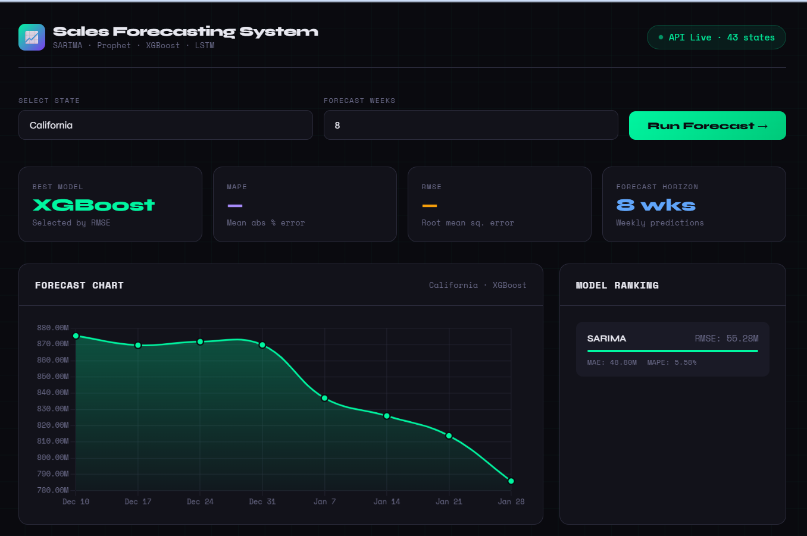
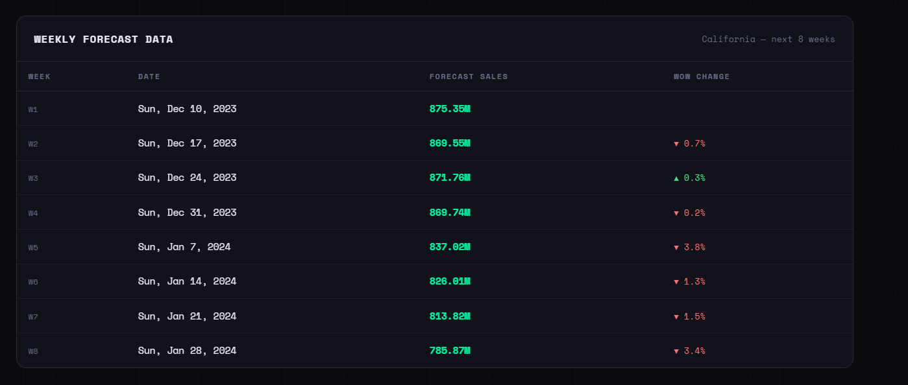

# 📈 Sales Forecasting System

<div align="center">


**A production-ready, end-to-end time series forecasting system that trains 4 ML models, auto-selects the best one, and serves predictions via a REST API with a live dashboard UI.**

</div>

---

## 📸 Screenshots

### Dashboard — Forecast Chart & Model Ranking


### Dashboard — Weekly Forecast Table


---

## 📌 Overview

This system forecasts the **next 8 weeks of sales for 43 US states** using historical data. It automatically trains and compares **SARIMA, Facebook Prophet, XGBoost, and LSTM** models, selects the best performer, and exposes predictions via a clean REST API with interactive Swagger docs and a beautiful dashboard UI.

---

## ✨ Features

- 🤖 **4 ML Models** — SARIMA, Facebook Prophet, XGBoost (with lag features), LSTM (deep learning)
- 🏆 **Auto Model Selection** — Picks the best model per state using RMSE on hold-out validation
- 🔧 **Feature Engineering** — Lag features (t-1, t-7, t-30), rolling mean/std, day-of-week, month, holiday flags
- 🚫 **No Data Leakage** — Strict temporal train/validation split
- 🌐 **REST API** — FastAPI with full Swagger UI documentation
- 📊 **Live Dashboard** — Beautiful dark-mode UI with forecast charts and model comparison
- 🗺️ **43 US States** — Individual models trained and forecasted per state
- 💾 **Persistent Results** — All forecasts and model metrics saved to JSON

---

## 🏗️ Project Structure

```
Sales-Forecasting-System/
│
├── 📁 api/
│   ├── __init__.py
│   └── app.py                  # FastAPI REST endpoints
│
├── 📁 data/
│   └── sales_data.xlsx         # Historical sales dataset
│
├── 📁 models/
│   ├── __init__.py
│   ├── arima_model.py          # SARIMA with AIC grid search
│   ├── prophet_model.py        # Facebook Prophet + US holidays
│   ├── xgboost_model.py        # XGBoost with lag features
│   └── lstm_model.py           # LSTM deep learning model
│
├── 📁 outputs/                 # Auto-generated after training
│   ├── all_results.json        # Metrics + forecasts for all states
│   └── models/                 # Saved best model per state (.pkl)
│
├── 📁 utils/
│   ├── __init__.py
│   └── data_preprocessing.py   # Load, clean, feature engineering
│
├── 📁 screenshots/             # README screenshots
│   ├── dashboard_main.png
│   └── dashboard_table.png
│
├── 📄 train.py                 # Main training entry point
├── 📄 dashboard.html           # Live UI Dashboard
├── 📄 requirements.txt         # All dependencies
└── 📄 README.md
```

---

## ⚡ Quick Start

### 1. Clone the repository
```bash
git clone https://github.com/raizaduggal12/Sales-Forecasting-System.git
cd Sales-Forecasting-System
```

### 2. Create and activate virtual environment
```bash
python -m venv venv

# Windows
venv\Scripts\activate

# macOS/Linux
source venv/bin/activate
```

### 3. Install dependencies
```bash
pip install -r requirements.txt
```

### 4. Train all models
```bash
python train.py
```
> ⏱️ This trains 4 models × 43 states. Expect **60–90 minutes** depending on your machine.
> When done you'll see: `Training complete. Results saved to outputs/all_results.json`

### 5. Start the API
```bash
uvicorn api.app:app --host 0.0.0.0 --port 8000 --reload
```

### 6. Open the Dashboard
Simply double-click `dashboard.html` in your file explorer, or visit:
```
http://localhost:8000/docs
```

---

## 🌐 API Endpoints

| Method | Endpoint | Description |
|--------|----------|-------------|
| `GET` | `/` | Health check — API status + states count |
| `GET` | `/states` | List all 43 available states |
| `GET` | `/forecast/{state}` | 8-week sales forecast for a state |
| `GET` | `/forecast/{state}?weeks=N` | Custom N-week forecast (max 52) |
| `GET` | `/metrics/{state}` | MAE, RMSE, MAPE for all 4 models |
| `GET` | `/best-model/{state}` | Best model name + full ranking |
| `GET` | `/summary` | Best model + metrics for all 43 states |
| `GET` | `/forecast-all` | Forecasts for every state in one call |
| `POST` | `/retrain` | Trigger background retraining |
| `GET` | `/training-status` | Check training status |

### Example Response — `GET /forecast/California`
```json
{
  "state": "California",
  "best_model": "XGBoost",
  "forecast_weeks": 8,
  "forecast": [
    { "date": "2023-12-10", "forecast_sales": 875352648.0 },
    { "date": "2023-12-17", "forecast_sales": 869551424.0 },
    { "date": "2023-12-24", "forecast_sales": 871760000.0 }
  ]
}
```

### Example Response — `GET /best-model/California`
```json
{
  "state": "California",
  "best_model": "XGBoost",
  "selection_criterion": "Lowest RMSE on hold-out validation set (last 8 weeks)",
  "ranking": [
    { "model": "XGBoost", "RMSE": 45253988.17, "MAPE": 4.9  },
    { "model": "Prophet", "RMSE": 52960812.13, "MAPE": 5.44 },
    { "model": "SARIMA",  "RMSE": 55277181.12, "MAPE": 5.58 },
    { "model": "LSTM",    "RMSE": 58741658.86, "MAPE": 6.12 }
  ]
}
```

---

## 🧠 Models Implemented

### 1. SARIMA
- Auto order selection via AIC grid search
- Handles trend and seasonality
- Seasonal period = 52 weeks

### 2. Facebook Prophet
- Yearly seasonality
- US public holidays integration
- Multiplicative seasonality mode
- Changepoint detection

### 3. XGBoost
- Lag features: t-1, t-2, t-4, t-8, t-13, t-26, t-52
- Rolling statistics: mean, std, min, max (4, 8, 13, 26 week windows)
- Calendar features: day of week, month, quarter, year, holiday flag
- Recursive multi-step forecasting

### 4. LSTM (Deep Learning)
- 2-layer LSTM with dropout and batch normalization
- Lookback window: 26 weeks
- MinMax scaled inputs
- Early stopping + learning rate reduction

---

## 🔧 Feature Engineering

| Feature | Description |
|---------|-------------|
| `lag_1, lag_2, lag_4` | Previous 1, 2, 4 week sales |
| `lag_8, lag_13, lag_26, lag_52` | 2m, 3m, 6m, 1yr lag |
| `rolling_mean_4/8/13/26` | Rolling average (no leakage) |
| `rolling_std_4/8/13/26` | Rolling std deviation |
| `day_of_week` | 0=Monday … 6=Sunday |
| `month` | 1–12 |
| `quarter` | 1–4 |
| `holiday_flag` | 1 if US public holiday, else 0 |
| `trend` | Linear time index |

---

## 📊 Dashboard UI

The dashboard connects live to the API and provides:
- 🔽 State selector dropdown (all 43 states)
- 📈 Interactive forecast line chart (Chart.js)
- 🏆 Model ranking with RMSE bar comparison
- 📋 Weekly forecast table with week-on-week % change
- 📊 Summary stats: Best model, MAPE, RMSE, forecast horizon

---

## 🛠️ Tech Stack

| Layer | Technology |
|-------|-----------|
| Language | Python 3.10+ |
| API Framework | FastAPI + Uvicorn |
| Deep Learning | TensorFlow / Keras |
| Gradient Boosting | XGBoost |
| Time Series | statsmodels (SARIMA), Prophet |
| Data Processing | Pandas, NumPy |
| Feature Engineering | scikit-learn, holidays |
| Frontend | HTML, CSS, JavaScript, Chart.js |
| Data Format | Excel (.xlsx), JSON, Pickle |

---

## 📦 Requirements

```
pandas
numpy
openpyxl
statsmodels
prophet
xgboost
tensorflow
scikit-learn
fastapi
uvicorn[standard]
holidays
pydantic
```

---

## 👩‍💻 Author

**Raiza Duggal**
- GitHub: [@raizaduggal12](https://github.com/raizaduggal12)

---

## 📄 License

This project is licensed under the MIT License.

---

<div align="center">
  <strong>Built with ❤️ as an end-to-end Data Science project</strong>
</div>
